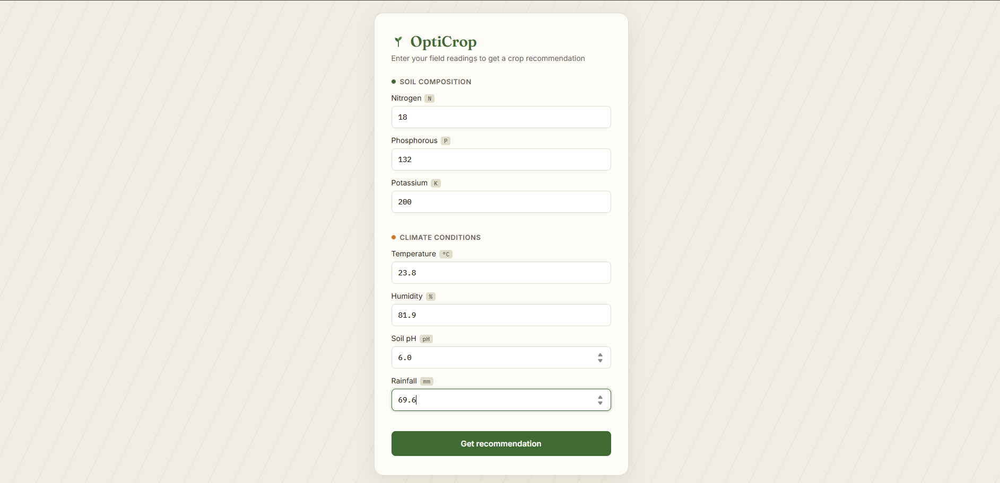

# 🌱 OptiCrop: Smart Agricultural Production Optimization Engine

OptiCrop is a machine learning-based agricultural recommendation system that suggests the most suitable crop to grow based on soil nutrients and environmental conditions. It integrates a trained classification model with a Flask web application to give farmers, agricultural researchers, and policymakers a simple, data-driven way to make crop planning decisions.

## 🔗 Live Demo

**Link:** https://opticrop-84uf.onrender.com

## Demo
> Open the app → enter your soil and climate readings → OptiCrop recommends the best-suited crop instantly




## Problem Statement (Epic 1)

Farmers often rely on experience or generic guidance when deciding which crop to grow, without a systematic way to factor in their specific soil composition and local climate. Choosing an unsuitable crop for the given conditions leads to lower yields, wasted resources, and reduced income.

OptiCrop addresses this by taking seven measurable inputs — Nitrogen (N), Phosphorous (P), Potassium (K), temperature, humidity, pH, and rainfall — and using a trained machine learning model to recommend the crop most likely to thrive under those exact conditions.

**Target users:**
- **Farmers** — get an instant crop recommendation for their specific field conditions.
- **Agricultural researchers/policymakers** — analyze crop-environment relationships to support broader farming and land-use strategy.

**Scenarios covered:**
1. **Smart Crop Recommendation** — a farmer enters field readings and receives a recommended crop.
2. **Crop Suitability Assessment** — the same inputs can be used to sanity-check whether current conditions suit a crop the farmer already has in mind.
3. **Research & Policy Planning** — the underlying dataset and model insights (feature importance, correlations) support broader agricultural analysis.

## Tech Stack

| Layer | Technology |
|---|---|
| Language | Python 3.10+ |
| Data handling | Pandas, NumPy |
| Visualization | Matplotlib, Seaborn |
| Machine Learning | Scikit-learn |
| Model persistence | Joblib (see note below) |
| Backend | Flask |
| Frontend | HTML, CSS, JavaScript (see note below) |
| Environment | Python venv |
| Version control | Git / GitHub |

## Project Structure

```
OptiCrop/
├── data/
│   ├── raw/              # Original dataset (Crop_recommendation.csv)
│   ├── processed/        # Cleaned, encoded, scaled train/test splits
│   └── external/         # Reserved for supplementary datasets (unused currently)
├── notebooks/
│   ├── 01_data_collection.ipynb
│   ├── 02_eda_analysis.ipynb
│   ├── 03_data_preprocessing.ipynb
│   ├── 04_model_building.ipynb
│   └── 05_model_evaluation.ipynb
├── src/
│   ├── data_preprocessing.py
│   ├── train_model.py
│   ├── predict.py
│   └── utils.py
├── models/                # Trained model, scaler, and label encoder (.pkl)
├── app/
│   ├── app.py             # Flask entry point
│   ├── templates/         # index.html, result.html
│   └── static/             # CSS and JS
├── tests/
│   └── test_model.py
├── reports/
│   ├── figures/           # EDA and evaluation plots
│   └── ERD_diagram.png
├── requirements.txt
└── README.md
```

## Setup Instructions

**1. Clone the repository**
```powershell
git clone https://github.com/MaheshRaghava/OptiCrop.git
cd OptiCrop
```

**2. Create and activate a virtual environment**
```powershell
python -m venv venv
.\venv\Scripts\Activate.ps1
```

**3. Install dependencies**
```powershell
pip install -r requirements.txt
```

**4. Run the Flask app**
```powershell
cd app
python app.py
```

Open `http://127.0.0.1:5000` in your browser.

**5. (Optional) Retrain the model from scratch**
```powershell
cd src
python train_model.py
```

**6. (Optional) Run tests**
```powershell
python tests\test_model.py
```

## Project Flow (Epics)

| Epic | Description | Status |
|---|---|---|
| Pre-requisite | Entity Relationship Diagram | ✅ Complete |
| Epic 1 | Define Problem and Understanding | ✅ Complete |
| Epic 2 | Data Collection and Analysis | ✅ Complete |
| Epic 3 | Data Pre-processing | ✅ Complete |
| Epic 4 | Model Building | ✅ Complete |
| Epic 5 | Application Building | ✅ Complete |

## Dataset

- **Source:** [Crop Recommendation Dataset (Kaggle)](https://www.kaggle.com/datasets/atharvaingle/crop-recommendation-dataset)
- **Size:** 2,200 rows, 8 columns
- **Features:** N, P, K, temperature, humidity, pH, rainfall
- **Target:** 22 crop types, perfectly balanced (100 samples each)
- **Quality:** No missing values, no duplicate rows

## Model Performance

Six classification models were trained and compared:

| Model | Accuracy |
|---|---|
| Logistic Regression | 97.27% |
| Decision Tree | 97.95% |
| KNN | 97.95% |
| SVM | 98.41% |
| **Random Forest (selected)** | **99.55%** |
| Naive Bayes | 99.55% |

**Random Forest** was selected as the production model. It was further validated using 5-fold cross-validation (mean accuracy: 99.32%, std deviation: 0.0043 — confirming stability across different data splits) and a confusion matrix showing near-perfect classification across all 22 crops.

**Top predictive features:** rainfall, humidity, and potassium (K) contributed the most to predictions; pH and temperature contributed the least.

As additional analysis, unsupervised K-Means clustering was also explored to see whether crops naturally group by environmental profile without label information (Adjusted Rand Index: 0.6486 — a moderately strong natural grouping, though not as precise as the supervised Random Forest model).

## Known Limitations

- The model can only recommend one of the **22 crops** present in the training data. It cannot recognize or suggest crops outside this list (e.g. wheat, sugarcane, tomato).
- Recommendations are based solely on the 7 numeric inputs; other real-world factors (soil type/texture, elevation, pest risk, market demand) are not considered.
- The dataset represents general agronomic conditions and may not perfectly reflect hyper-local soil or microclimate variation.

## Technical Notes

- **Joblib vs. Pickle:** the project brief specifies Pickle for model persistence; this project uses `joblib` instead, which is the standard recommended library for saving/loading Scikit-learn models. Joblib still produces `.pkl` files and is a drop-in-equivalent choice, more efficient for objects containing large NumPy arrays.
- **Custom CSS vs. Bootstrap:** the frontend uses hand-written CSS instead of Bootstrap, to allow a more tailored, distinctive visual design for the crop recommendation form and result page.

## Team

| Name | Role |
|---|---|
| Bonthu Sri Teja | Team Lead |
| Mahesh Raghava | Member |
| Sai Sarath | Member |
| Nerella Vivek | Member |
| Padamata Gowtham | Member |

## Skills Applied

NumPy, Pandas, Scikit-learn, Matplotlib, SciPy, Seaborn, Flask, Machine Learning

## Conclusion

OptiCrop demonstrates a complete, functioning pipeline from raw agricultural data to a deployed web application — covering data collection, exploratory analysis, preprocessing, model comparison and evaluation, and a working Flask-based user interface. The Random Forest model achieves 99.55% test accuracy, providing farmers with a fast, reliable way to identify the most suitable crop for their specific soil and climate conditions.